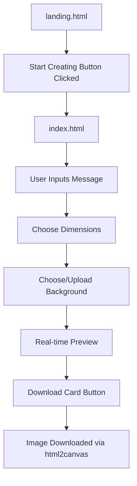
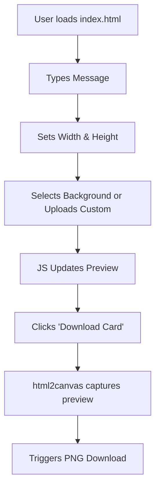
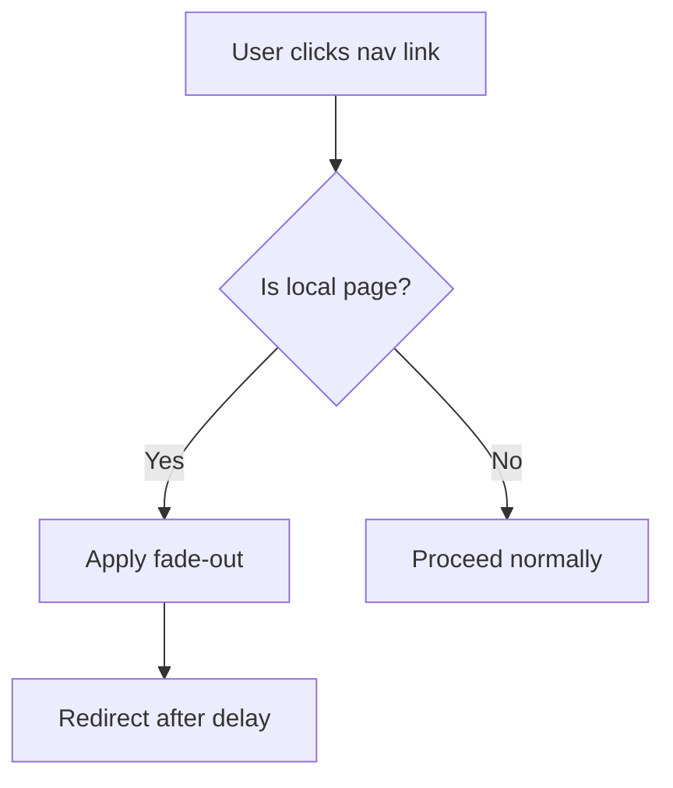

# 💌 Cardify – Online Greeting Card Maker

Cardify is a lightweight, responsive web application that allows users to **create, customize, preview, and download greeting cards** effortlessly using pre-set or uploaded backgrounds.

> A delightful tool for sending wishes with a personal touch.

---

## 🖼️ Live Demo

*Coming Soon...*  
You can deploy it easily via **Netlify**, **Vercel**, or **GitHub Pages**.

---

## 🎯 Features

- ✏️ **Write your message** directly on the card
- 🎨 **Choose from preset backgrounds** or upload your own image
- 📏 **Customize dimensions** of the card in pixels
- 🔎 **Live preview** updates in real-time
- ⬇️ **Download your card as a high-quality PNG image**
- 🌐 **Smooth fade-in/fade-out transitions** between pages
- 💻 **Responsive UI** – works across desktops, tablets, and mobile

---

## 🧾 File Structure

```plaintext
├── index.html          # Greeting card editor UI
├── landing.html        # Welcome/landing page
├── styles.css          # Styles for card editor
├── landing.css         # Styles for landing page
├── script.js           # Card customization logic
├── transition.js       # Fade transition between pages
└── README.md           # You're reading it
````

---

## 🧠 Application Flow – Diagrams

### 🧩 Core Flow



---

### 🎮 Functional Flow of Buttons



---

### 🔄 Navigation Transition Logic



---

## 💡 Technology Stack

| Tech         | Role                                  |
| ------------ | ------------------------------------- |
| HTML5        | Page structure                        |
| CSS3         | Styling and layout                    |
| JavaScript   | UI interactivity                      |
| html2canvas  | Convert DOM to downloadable PNG image |
| Google Fonts | Custom typography                     |

---

## 🚀 Getting Started

1. **Clone the repo**

```bash
git clone https://github.com/your-username/cardify.git
cd cardify
```

2. **Open landing.html in browser**
   Start from the landing page and click **Start Creating**.

3. **OR directly open index.html**
   Begin creating cards right away.

> No server or build step needed. Pure HTML/CSS/JS.

---

## 🔧 Customization Tips

* ✨ Add more preset background options inside `index.html`
* 🎨 Change default font by modifying `styles.css` and Google Fonts in `<head>`
* 📐 Adjust layout responsiveness via `@media` queries in `styles.css` and `landing.css`

---

## 📌 Future Improvements

| Area                      | Suggestions                                                      |
| ------------------------- | ---------------------------------------------------------------- |
| 💾 Save Feature           | Save projects locally using `localStorage` or download .json     |
| 💼 Template Categories    | Birthday, Wedding, Festivals, etc. with themed fonts/backgrounds |
| 🔤 Font Selector          | Dropdown to switch between fonts dynamically                     |
| 🌈 Color Picker           | Change font color or add background overlays                     |
| 📱 PWA Support            | Turn it into a Progressive Web App (Add to Home Screen)          |
| 🌍 Multi-language Support | Allow users to enter and preview messages in different languages |
| 🎥 Animation              | Animate card preview entry/fade/scale                            |
| 🧾 Shareable Link         | Generate card shareable via unique URL (requires backend)        |
| 👩‍🎨 Drag & Drop UI      | Drag text or images into position within the card preview        |

---

## 🌐 Deployment

| Platform         | Method                                           |
| ---------------- | ------------------------------------------------ |
| **Netlify**      | Drag and drop the folder or link to GitHub repo  |
| **Vercel**       | Import project via GitHub and auto-deploy        |
| **GitHub Pages** | Push to `main` and enable Pages in repo settings |

---

## 🙌 Author

Developed by Team 9!
With ❤️ for creative design & user experience.

---
---

````markdown
# 📚 Full Line-by-Line Code Explanation – Cardify

This section explains every line of code across the project: HTML, CSS, and JavaScript files. Use this to understand how each component works under the hood.

---

## 🧾 index.html – Greeting Card Creator

```html
<!DOCTYPE html>
````

Declares the HTML5 doctype.

```html
<html lang="en">
```

Specifies the language as English.

```html
<head>
  <meta charset="UTF-8">
```

Defines character encoding as UTF-8 for wide character support.

```html
  <meta name="viewport" content="width=device-width, initial-scale=1.0">
```

Makes the layout responsive on all devices.

```html
  <title>Online Greeting Card Maker</title>
```

Sets the page title shown on the browser tab.

```html
  <link rel="stylesheet" href="styles.css">
```

Links to the main stylesheet for this page.

```html
</head>
<body>
```

Begins the visible body section of the page.

```html
  <div class="container">
```

Main wrapper holding both the customization and preview sections.

---

### 🎛️ Customization Section

```html
    <div class="controls">
```

Sidebar where the user interacts with inputs.

```html
      <h2>Customize Your Card</h2>
```

Header inside the controls section.

```html
      <label>Message:<br>
        <textarea id="card-message" rows="4" placeholder="Type your greeting..."></textarea>
      </label>
```

Text area for entering the greeting message.

```html
      <br>
      <label>Card Width (px):
        <input type="number" id="card-width" min="200" max="1000" value="400">
      </label>
```

Number input to set card width.

```html
      <label>Card Height (px):
        <input type="number" id="card-height" min="200" max="1000" value="250">
      </label>
```

Number input to set card height.

```html
      <br>
      <label>Background:
        <select id="background-select">
          <option value="backgrounds/bg1.jpg">Sample 1</option>
          <option value="backgrounds/bg2.jpg">Sample 2</option>
          <option value="backgrounds/bg3.jpg">Sample 3</option>
        </select>
      </label>
```

Dropdown to choose a background.

```html
      <label>Or upload your own background:
        <input type="file" id="background-upload" accept="image/*" style="display:none;">
        <label for="background-upload" class="upload-icon-label" title="Upload background">
          <svg class="upload-icon" width="28" height="28" ... />
        </label>
      </label>
```

Hidden file input with custom SVG label for background upload.

```html
      <br>
      <button id="download-btn" type="button">Download Card</button>
```

Triggers card download using html2canvas.

---

### 👁️ Live Preview Section

```html
    </div>
    <div class="preview-section">
      <h2>Live Preview</h2>
      <div id="card-preview" class="card-preview">
        <span id="preview-message"></span>
      </div>
    </div>
  </div>
```

Renders the final preview of the card in real time.

---

### 📜 Scripts

```html
  <script src="script.js"></script>
  <script src="transition.js"></script>
  <script src="https://cdn.jsdelivr.net/npm/html2canvas@1.4.1/dist/html2canvas.min.js"></script>
</body>
</html>
```

JavaScript and third-party libraries for interactivity and download logic.

---

## 🎨 styles.css – Card Creator Styling

```css
body {
  font-family: 'Segoe UI', Arial, sans-serif;
  background: linear-gradient(135deg, #f5f6fa 0%, #d1d5db 100%);
  margin: 0;
  padding: 0;
  color: #222;
  opacity: 0;
  transition: opacity 350ms cubic-bezier(.4,0,.2,1);
}
```

Sets the default background, font, and adds fade transitions.

```css
body.fade-in { opacity: 1; }
body.fade-out { opacity: 0; }
```

Classes used for fade-in/out transitions via JS.

```css
.container {
  display: flex;
  flex-wrap: wrap;
  justify-content: center;
  ...
}
```

Main layout container using Flexbox.

```css
.controls { ... }
```

Styles for the sidebar control panel.

```css
.controls input, textarea, select { ... }
```

Uniform styles for all form inputs.

```css
.upload-icon-label, .upload-icon { ... }
```

Styles for the circular upload button with SVG icon.

```css
#download-btn { ... }
```

Styles and hover effects for the download button.

```css
.card-preview, #preview-message { ... }
```

Live preview styles including background, message font, and layout.

---

## 🌐 landing.html – Landing Page

```html
<nav class="glass-nav"> ... </nav>
```

Top navbar with glassmorphism style.

```html
<section class="hero-section" id="home"> ... </section>
```

Main hero section with heading, CTA button and sample cards.

```html
<a href="index.html" class="cta-btn">Start Creating</a>
```

Call-to-action to enter the card maker.

```html
<section class="features-section" id="features"> ... </section>
```

Feature highlights of the application.

```html
<footer class="landing-footer" id="contact"> ... </footer>
<script src="transition.js"></script>
```

Footer with copyright and transition.

---

## 🎨 landing.css – Styles for Homepage

* `.glass-nav` – Fixed blurred navbar
* `.hero-section` – Full-height landing banner
* `.floating-card` – Sample card emojis with hover animation
* `.feature-card` – Boxes showcasing app features
* Responsive layout via `@media` queries

---

## ⚙️ script.js – Interactivity Logic

```js
const messageInput = document.getElementById('card-message');
...
const preview = document.getElementById('card-preview');
```

Grabs all key DOM elements for manipulation.

```js
function updatePreview() { ... }
```

Updates preview box with new message, size, and background.

```js
messageInput.addEventListener('input', updatePreview);
...
```

Listeners to trigger `updatePreview()` when any input is changed.

```js
uploadInput.addEventListener('change', function(e) {
  const file = e.target.files[0];
  ...
});
```

Handles reading and previewing custom uploaded background.

```js
downloadBtn.addEventListener('click', function() {
  html2canvas(preview).then(canvas => {
    const link = document.createElement('a');
    link.download = 'greeting-card.png';
    link.href = canvas.toDataURL('image/png');
    link.click();
  });
});
```

Renders the preview to canvas and triggers image download.

---

## 🔄 transition.js – Page Fade Logic

```js
function fadeIn() {
  document.body.classList.add('fade-in');
  document.body.classList.remove('fade-out');
}
```

Fades the page in on load.

```js
function fadeOutAndRedirect(url) {
  document.body.classList.remove('fade-in');
  document.body.classList.add('fade-out');
  setTimeout(() => {
    window.location.href = url;
  }, 350);
}
```

Fades page out before navigating to new page.

```js
window.addEventListener('DOMContentLoaded', () => {
  fadeIn();
  document.querySelectorAll('a.page-link, a.cta-btn').forEach(link => {
    const href = link.getAttribute('href');
    if (href && !href.startsWith('#') && !link.hasAttribute('target')) {
      e.preventDefault();
      fadeOutAndRedirect(href);
    }
  });
});
```

Triggers fade logic only for local links to avoid abrupt navigation.


## 🖼️ Sample Preview

> .png)
---
